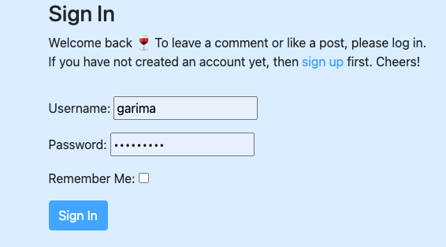

# :purple_circle: *Viña - your vinotheque* :purple_circle:

Have you ever found yourself standing in front of the overwhelming wine cupboard in a supermarket, not knowing what to buy? Me: Yes! And my friends too. I was imagining how great it would be to have an app that serves as both my private wine library and a platform for showcasing.

 

🍷 The deployed page can be found [here](https://vina1312-ae94d8859b43.herokuapp.com/) 🍷

If you do not want to register for testing the Viña App feel free to use:
<Username: Winelover>
<Password: oenology>

## Table of Contents

- [Objective](#objective)
- [User Stories](#user-stories)
- [Key Features](#key-features)
- [Database](#database)
- [Design](#design)
- [Testing](#testing)
  - [Manual](#manual)
  - [Official Validators](#official-validators)
  - [Bugs](#bugs)
- [Technologies](#technologies)
- [Deployment](#deployment)
- [Project Status](#project-status)
- [Acknowledgements](#acknowledgements)

## Objective

- Hands-on learning by building an interactive, data-based web app
- To offer a help for users to decide which bottle of wine to buy
- Creating a platform for wine lovers to share their recomendations as well as their experiences

## User Stories

### As a Logged-in-user [...]

- I want to add and delete wines to my private library/vinotheque.
- I want to commment on my own or others users' post.
- I want to be able to edit or delete my comments.
- I want to see if I am logged-in or not.
- I want to lika and unlike Posts.
- I want to see the list of all my liked Posts, and being transferred to that one when clicking on it. 
- I want to be transferred to the Post when 
- I expect a consistent and responsive design for easy use on various devices, prioritizing mobile devices first.

### As a Guest-user [...]

- I want to read recommendations (posts and comments).
- I want to easily navigate the site.
- I want to be able to create my own profile.

### As a Super-user = Admin [...]

- I want to to approve or disapprove user's new entries/posts
- I want to approve or dissaprove comments on existing entries.

## Key Features

### Pre-Entry Page

  

- The welcome page has a age verification.
- Validating for entry and age >= 18.
- Header not displaying navbar links in order not to be able to avoid age validation.

### Header

  

### Home (= all Posts)

   

- Displaying all wine blog entries
- Pagination = 4 with previous and next buttons

#### Details of 1 specific Post with like/unlike Function

  

- Displaying details of one wine
- Like/unlike Button -> will be added/deleted to favorite wine list
- Back Home button -> for better UX

#### Create / Edit / Delete a Comment

  

### User Login

  

- Unlogged user will be transferred to Sign In when trying to add comment or use like/unlike button.

### My Vinotheque

#### List of Liked Post

  

- Displaying list of liked/unliked wine posts, name linked to that post.
- Marquee with info if a logged in user wants to become a super user.

#### Create new Diary Entry

  

- Form with validation for rating and date-format.

#### Overview of Diary Entries

  

- Table of diary entries, ordered by rating.
- Name is linking to details of this diary entry.

#### Details of 1 Diary Entry

  

- Display wine diary entry with picture (placeholder pic or if it exists uploaded pic by user).
- Delete entry or back to vinotheque buttons.
- Modal for delete action.

### Footer

  

- The footer contains a short impressum and links to social media accounts.

## Models

The Viña project has 4 models:

- Post model in the blog app is based on the Walkthrough project, and highly customized by me.
- Comment model in the blog app is based on the Walkthrough project.
- Diary model in the vinoteka app completely created by me.
- User model created by Django AllAuth.

See the Entity Realtionship Diagram here:

  

ERD had been created with Djangoviz: [PublicLink](https://gh.atlasgo.cloud/explore/ad1d21c7)

## Design

### Colors

The primary color, wine red, immediately conjures associations with red wine. To introduce a fresh contrast, I incorporated a light yet robust blue tone, reminiscent of the open skies often associated with vineyards. This combination captures both the depth of wine culture and the natural beauty of vineyard landscapes, creating a visually engaging experience for users.

### Logo

## Testing

### Manual

### Official Validators

- [W3C HTML Validator](./assets/img/htmlVal.png): No errors
- [W3C CSS Validator](./assets/img/CSSvalidator.png):  No errors
- [Lighthouse Chrome DevTools](./assets/img/lighthouseVal.png): Accessibility 100
- [WAVE](./assets/img/WAVEval.png): No errors for accessibility and color contrast

### Automated

### Bugs

#### Solved

- Comments couldn't be saved due to the status field not accepting input. This was resolved by replacing the CharField with the correct IntegerField.
- Alert was missing for users when they entered no age and pressed the submit button. This has been rectified.
- When a non-logged-in user clicked the like button, they were correctly redirected to the login form. However, after submission, there was no correct redirection. This issue has been fixed by updating the return HttpResponseRedirect.
- The navbar toggle icon was not visible. This was addressed with a workaround using CSS.
- Previously, uploaded user images were not displayed. This was fixed by setting enctype="multipart/form-data" in the form, allowing file uploads to function correctly. Oooh yess!

#### Unsolved

- Currently, users can bypass the age verification process by directly accessing /blog or /vinoteka URLs in the browser. While users can input a false age, it's challenging to enforce strict control over this aspect. The age verification serves as more of a soft barrier, reminding users rather than providing foolproof age verification.
- Date validation for new diary entry is working with default build in validation, but not on the ../movieteka site. For now user will be redirected to an unstyled site where the error is indicated and can be changed.

## Technologies

Python | HTML | CSS | JavaScript | Django | Bootstrap5 | Whitenoise | Gunicorn | Crispy | Neon Postgres DB | Heroku

## Project Status

Project is: in process

## Deployment

- The site is deployed with Heroku.

  HOW TO:

  1. **Go to Repository Settings:**
  
  2. **Scroll Down to GitHub Pages Section:**
     In the Settings, scroll down to the "GitHub Pages" section.
  
  3. **Choose Your Source Branch:**
     Under "Source," select the branch you want to use for GitHub Pages (e.g., `main`).
  
  4. **Save Your Changes:**
     Save the changes. GitHub Pages will provide you with a link to your deployed site.
  
  5. **Wait for the Build:**
     GitHub Pages will now build and deploy your site. Wait for the process to complete.
  
  6. **Access Your Deployed Site:**
     Once the build is successful, you can access your deployed site using the provided link.

  Your project is now live on GitHub Pages!
  🍷 Cheers !!

## Acknowledgements

This project is based on full-stack course @ Code Institute, especially the Walk-through-project "I Think Therefore I Blog"

